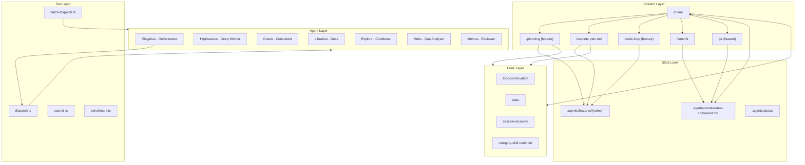
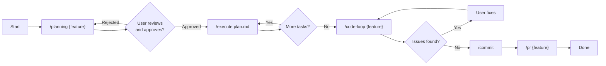
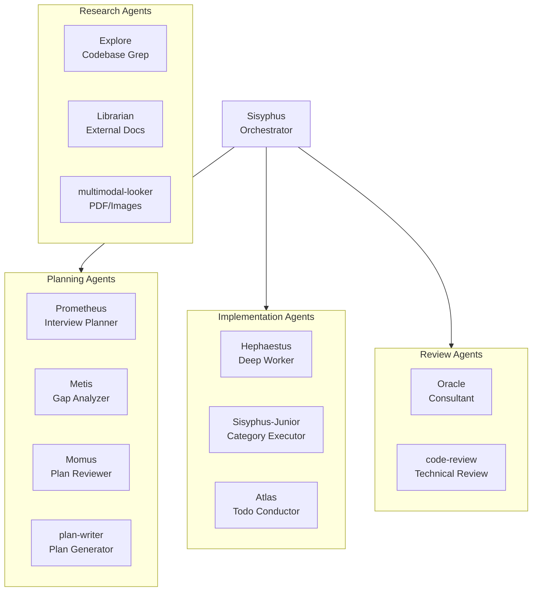
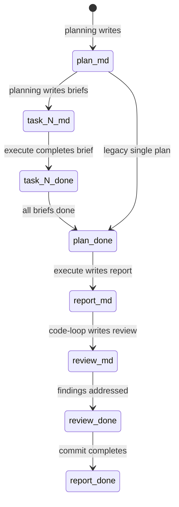
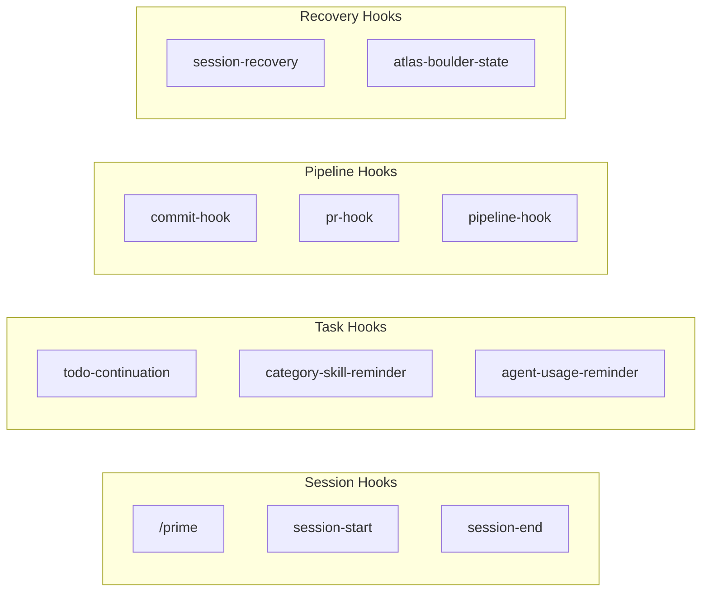
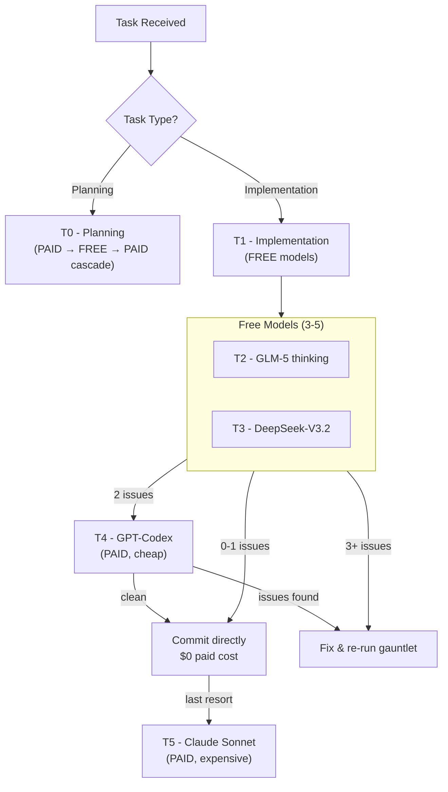
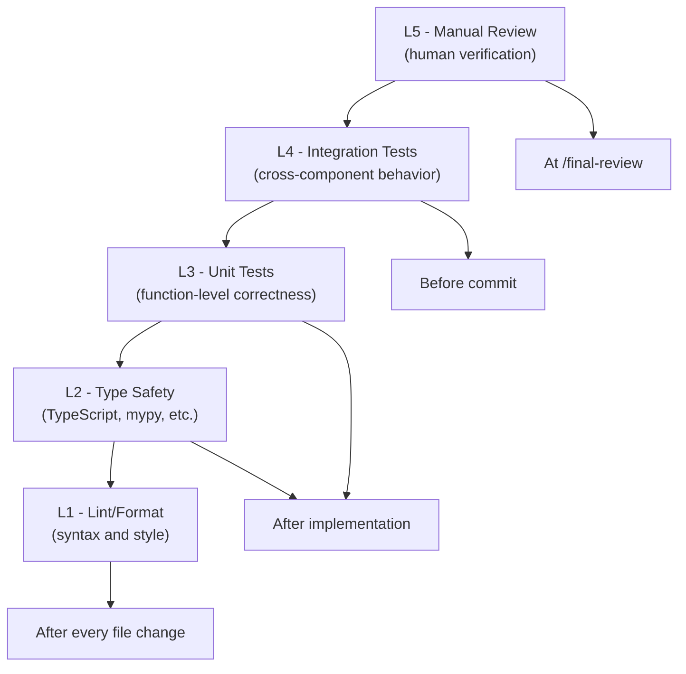
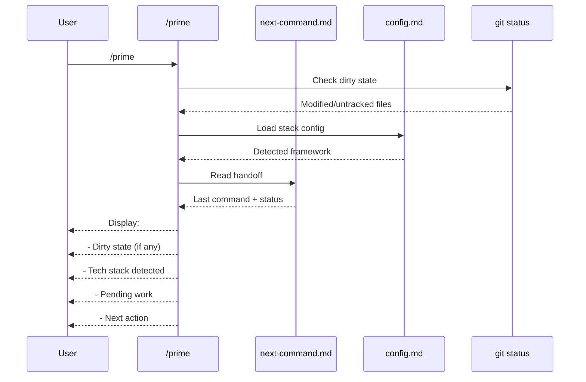

# OpenCode AI Coding System

A production-grade AI-assisted development framework built on [OpenCode](https://opencode.ai). This is not a prompt collection — it's a complete **development operating system** for AI-assisted engineering with structured workflows, cost optimization, and human oversight at every step.

---

## Why This Exists

Building software with AI is chaotic. Models hallucinate, lose context between sessions, and make changes without oversight. This system solves three critical problems:

| Problem | Solution |
|---------|----------|
| **Context Loss** | Session handoff via `.agents/context/next-command.md` — every session knows exactly where you left off |
| **Cost Overruns** | 5-tier model cascade — free models do 95% of the work, paid models only when needed |
| **Quality Issues** | PIV Loop with multi-model review gauntlet — code must pass 4 separate reviews before commit |

---

## Table of Contents

1. [How It Works](#how-it-works)
2. [Architecture Overview](#architecture-overview)
3. [The PIV Loop](#the-piv-loop)
4. [Slash Commands](#slash-commands)
5. [Sub-Agent System](#sub-agent-system)
6. [Orchestration Tools](#orchestration-tools)
7. [State Management](#state-management)
8. [Lifecycle Hooks](#lifecycle-hooks)
9. [5-Tier Model Cascade](#5-tier-model-cascade)
10. [5-Level Validation Pyramid](#5-level-validation-pyramid)
11. [Getting Started](#getting-started)
12. [Requirements](#requirements)

---

## How It Works

### The Core Insight

You are always in control. The system follows a strict **Plan → Implement → Validate** cycle where:

1. **You approve every plan** before any code is written
2. **You choose the execution method** (manual, Codex CLI, or agent dispatch)
3. **You fix issues** surfaced by the review gauntlet
4. **You verify commits and PRs** before they're created

### Session Model

Each session is one context window. The system is designed around this limitation:

```
Session 1: /prime → /planning feature-name   → END (you approve plan)
Session 2: /prime → /execute plan.md         → END (task 1 only)
Session 3: /prime → /execute plan.md         → END (task 2)
Session N: /prime → /code-loop feature-name  → END (you fix issues)
Session N+1: /prime → /commit → /pr feature  → END (you verify PR)
```

### What Happens Between Sessions

The `.agents/context/next-command.md` file stores your pipeline state:

```markdown
# Pipeline Handoff
- Last Command: /execute (task 2 of 4)
- Feature: user-auth
- Next Command: /execute .agents/features/user-auth/plan.md
- Task Progress: 2/4 complete
- Status: executing-tasks
```

When you run `/prime`, the system reads this file and tells you exactly what to run next. No context loss. No guessing.

---

## Architecture Overview



### Core Components

| Component | Purpose |
|-----------|---------|
| **Session Layer** | Slash commands you run in each session |
| **State Layer** | Files that persist state between sessions |
| **Agent Layer** | 11 specialized sub-agents for different tasks |
| **Tool Layer** | 4 TypeScript orchestration tools for multi-model dispatch |
| **Hook Layer** | 46 lifecycle hooks for completion guarantees |

---

## The PIV Loop

Every feature follows **Plan → Implement → Validate**. No exceptions.



### Hard Rules

| Rule | Enforcement |
|------|-------------|
| **Planning is mandatory** | `/planning` MUST run before any code is written |
| **User approval required** | Every plan must be reviewed and approved |
| **No direct code writing** | The orchestrator (Claude Opus) never writes code — only dispatches or provides task briefs |
| **Validation at every level** | Lint → Types → Unit Tests → Integration → Human review |

### Execution Options

The execution agent is a **swappable slot**. Choose your method:

| Method | When to Use |
|--------|-------------|
| **Manual** | Full control, learning, debugging |
| **Codex CLI** | Automated execution (default) |
| **Aider CLI** | Different agent preference |
| **Dispatch Agent** | T1 models via OpenCode server |

The task brief format (`.agents/features/{feature}/task-{N}.md`) is the universal interface — any agent, tool, or human can read it and implement.

---

## Slash Commands

### Session Management

| Command | Purpose |
|---------|---------|
| `/prime` | Load context, detect tech stack, surface pending work. **Always run this first.** |

### Planning Pipeline

| Command | Purpose |
|---------|---------|
| `/planning {feature}` | Interactive discovery → 700-1000 line plan + task briefs. **You approve.** |
| `/execute {plan.md}` | Implement from plan. Auto-detects task brief vs master mode. **You choose execution method.** |
| `/code-loop {feature}` | Multi-model review gauntlet. **You fix issues.** |
| `/commit` | Conventional commit with auto-detected scope. **You verify message.** |
| `/pr {feature}` | Create PR with structured body. **You review PR.** |

### Project Foundation

| Command | Purpose |
|---------|---------|
| `/mvp` | Socratic big-idea discovery. **You approve MVP document.** |
| `/prd` | Product Requirements Document from MVP. **You approve.** |
| `/pillars` | Define architectural pillars with gate criteria. **You approve.** |
| `/decompose` | Break PRD into ordered specs in `BUILD_ORDER.md`. **You approve.** |

### Code Quality

| Command | Purpose |
|---------|---------|
| `/code-review` | Technical review with Critical/Major/Minor findings. **You review.** |
| `/code-review-fix {review.md}` | Apply fixes by severity. **You approve fixes.** |
| `/final-review` | Human approval gate before commit. |
| `/system-review` | Divergence analysis — plan vs implementation. |

### Utilities

| Command | Purpose |
|---------|---------|
| `/council {topic}` | Multi-model discussion (3-10 models see each other's responses). |

---

## Sub-Agent System

11 specialized sub-agents for different tasks:



### Agent Roles

| Agent | Role | Use When |
|-------|------|----------|
| **Sisyphus** | Orchestrator | Session management, delegation decisions |
| **Hephaestus** | Deep Worker | Complex algorithm implementation, architecture refactoring |
| **Atlas** | Todo Conductor | Progress tracking, wisdom accumulation |
| **Prometheus** | Interview Planner | Requirement discovery, scope clarification |
| **Oracle** | Consultant | Architecture decisions, multi-system tradeoffs |
| **Metis** | Gap Analyzer | Pre-planning analysis, hidden assumption detection |
| **Momus** | Reviewer | Plan completeness verification |
| **Explore** | Codebase Grep | Internal codebase patterns, file location |
| **Librarian** | External Docs | official documentation, library examples |
| **Sisyphus-Junior** | Category Executor | Task execution via category dispatch |
| **multimodal-looker** | PDF/Images | Document analysis, diagram interpretation |

### Permission Levels

| Level | readFile | writeFile | editFile | bash | grep | task |
|-------|----------|-----------|----------|------|------|------|
| `full` | ✓ | ✓ | ✓ | ✓ | ✓ | ✓ |
| `full-no-task` | ✓ | ✓ | ✓ | ✓ | ✓ | ✗ |
| `read-only` | ✓ | ✗ | ✗ | ✗ | ✓ | ✗ |
| `vision-only` | ✗ | ✗ | ✗ | ✗ | ✗ | ✗ |

---

## Orchestration Tools

Four TypeScript tools for multi-model dispatch:

### `dispatch.ts`

Route prompts to any AI model:

```typescript
// Task type routing (auto-selects model)
dispatch({ taskType: "code-review", prompt: "Review this for bugs: ..." })

// Explicit model selection
dispatch({
  mode: "agent",
  provider: "bailian-coding-plan-test",
  model: "qwen3.5-plus",
  prompt: "Implement X. Read existing code first."
})
```

**Three modes:**
- `text` — prompt in, text out (reviews, analysis)
- `agent` — full file read/write, bash, grep access (implementation)
- `command` — run slash commands (`/planning`, `/code-review`)

### `batch-dispatch.ts`

Send same prompt to multiple models in parallel:

```typescript
batchDispatch({
  prompt: "Review this code for security issues",
  batchPattern: "free-review-gauntlet"  // 5 models
})
```

**10 batch patterns:**

| Pattern | Models | Use Case |
|---------|--------|----------|
| `free-review-gauntlet` | 5 free models | Consensus code review |
| `free-impl-validation` | 3 free models | Quick post-implementation check |
| `free-plan-review` | 4 free models | Plan critique |
| `free-security-audit` | 3 free models | Security-focused review |

**Smart escalation:**
- 0-1 models flag issues → commit directly ($0 paid cost)
- 2 models flag issues → run T4 tiebreaker (paid model)
- 3+ models flag issues → fix and re-run gauntlet

### `council.ts`

Multi-model discussion where models see each other's responses:

```
/council "Should we use event sourcing or direct DB updates?"
```

### `benchmark.ts`

Benchmark all free models against a standardized code review diff. Generates `model-scores.json` for the code-loop gauntlet.

---

## State Management

The system uses file renaming, not databases:



### Artifact Lifecycle

| Artifact | Created By | Marked `.done.md` By | Trigger |
|----------|-----------|---------------------|---------|
| `plan.md` | `/planning` | `/execute` | All task briefs done |
| `task-{N}.md` | `/planning` | `/execute` | Task brief fully executed |
| `report.md` | `/execute` | `/commit` | Changes committed |
| `review.md` | `/code-review` | `/commit` | Findings addressed |
| `loop-report-{N}.md` | `/code-loop` | `/code-loop` | Clean exit |

### Directory Structure

```
.agents/
├── context/
│   └── next-command.md          ← Pipeline handoff (read by /prime)
├── features/{name}/
│   ├── plan.md                  ← Feature overview + task index
│   ├── task-{N}.md              ← Self-contained task briefs
│   ├── task-{N}.done.md         ← Completed tasks
│   ├── report.md                ← Execution report
│   └── review-{N}.md            ← Code review artifacts
└── specs/
    ├── BUILD_ORDER.md           ← Ordered spec list
    ├── PILLARS.md               ← Pillar definitions
    └── build-state.json         ← Cross-session progress
```

---

## Lifecycle Hooks

46 hooks enforce completion guarantees and state persistence:



### Key Hooks

| Hook | Purpose |
|------|---------|
| `todo-continuation` | Preserves todo state across context compactions |
| `category-skill-reminder` | Reminds to load appropriate skills for task categories |
| `agent-usage-reminder` | Suggests explore/librarian agents instead of direct tool calls |
| `session-recovery` | Detects errors and provides recovery suggestions |
| `atlas` | Manages boulder state for continuous work sessions |

---

## 5-Tier Model Cascade

The system routes tasks to the cheapest capable model:



### Tier Breakdown

| Tier | Role | Models | Cost |
|------|------|--------|------|
| T0 | Planning | GPT-5.3-Codex → Qwen3-Max → Qwen3.5-Plus → Claude Opus | PAID → FREE → PAID |
| T1 | Implementation | Qwen3.5-Plus, Qwen3-Coder-Next, Qwen3-Coder-Plus | FREE |
| T2 | First validation | GLM-5 (thinking) | FREE |
| T3 | Second validation | DeepSeek-V3.2, Kimi-K2, Gemini-3-Pro | FREE |
| T4 | Code review gate | GPT-5.3-Codex | PAID (cheap) |
| T5 | Final review | Claude Sonnet-4-6 | PAID (expensive) |

### Cost Optimization

| Scenario | Cost |
|----------|------|
| 0-1 free models flag issues | **$0** — commit directly |
| 2 free models flag issues | **~$0.01** — T4 tiebreaker |
| 3+ free models flag issues | **$0** — fix loop, re-run with free models |

Paid models are only triggered when needed. Most commits cost nothing.

---

## 5-Level Validation Pyramid



### Validation Levels

| Level | What | When | Configured In |
|-------|------|------|---------------|
| L1 Lint | Syntax and style | After every file change | `.opencode/config.md` |
| L2 Types | Type safety | After implementation | `.opencode/config.md` |
| L3 Unit Tests | Function-level correctness | After implementation | `.opencode/config.md` |
| L4 Integration Tests | Cross-component behavior | Before commit | `.opencode/config.md` |
| L5 Manual | Human verification | At `/final-review` | Code review gauntlet |

### Configuration Example

```markdown
# .opencode/config.md

## Validation Commands
- L1 Lint: npx eslint .
- L2 Types: npx tsc --noEmit
- L3 Unit Tests: npx vitest run
- L4 Integration Tests: npx vitest run --reporter=verbose integration/
- L5 Manual: Human review via /code-loop
```

---

## Getting Started

### New Project

```bash
# 1. Copy framework to your project
cp -r opencode-ai-coding-system/.opencode your-project/
cp -r opencode-ai-coding-system/.claude your-project/
cp opencode-ai-coding-system/AGENTS.md your-project/

# 2. Start your first session
/prime
/mvp          # Discover your product vision
/prd          # Create PRD from MVP
/pillars      # Define architectural pillars
/decompose    # Break into ordered specs

# 3. For each spec:
/prime
/planning {spec-name}
# (you review and approve plan)
# (you execute: manually, Codex, or agent)
/prime
/code-loop {spec-name}
# (you fix until clean)
/prime
/commit
/pr {spec-name}
```

### Existing Project

```bash
# 1. Copy framework
cp -r opencode-ai-coding-system/.opencode your-project/
cp -r opencode-ai-coding-system/.claude your-project/
cp opencode-ai-coding-system/AGENTS.md your-project/

# 2. Start planning a feature
/prime
/planning {feature-name}
# (continue as above)
```

### What Happens When You Run `/prime`



---

## Requirements

| Requirement | Purpose |
|-------------|---------|
| [OpenCode](https://opencode.ai) | Multi-model dispatch (`opencode serve`) |
| `git` CLI | Version control |
| `gh` CLI | Pull request creation |
| Node.js / Bun | TypeScript tools in `.opencode/tools/` |
| Archon MCP (optional) | Persistent task tracking, RAG knowledge base |
| Model API keys | Configured in OpenCode setup |

### Quick Install

```bash
# Install OpenCode CLI globally
npm install -g @anthropics/opencode

# Or via the official installer
curl -fsSL https://opencode.ai/install.sh | bash

# Verify installation
opencode --version

# Upgrade to latest
opencode upgrade
```

**OpenCode Repository**: [https://github.com/anthropics/opencode](https://github.com/anthropics/opencode)

---

## License

MIT

---

## Contributing

1. Fork the repository
2. Create a feature branch
3. Run `/planning your-feature`
4. Follow the PIV Loop
5. Submit a PR

---

## Acknowledgments

Built on [OpenCode](https://opencode.ai) — the AI coding assistant framework.